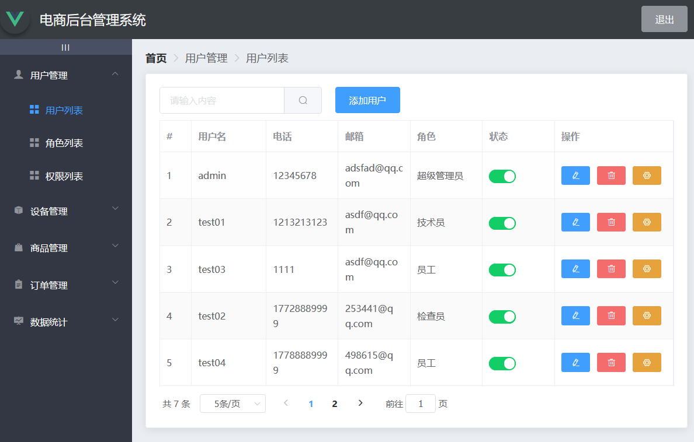
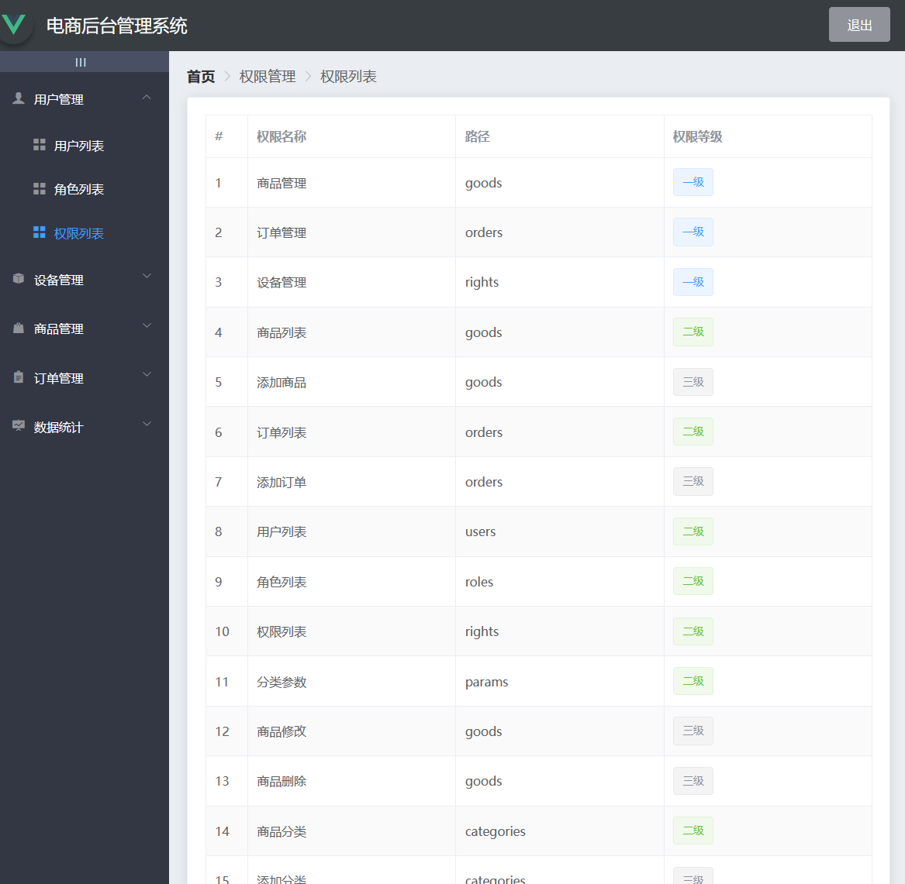
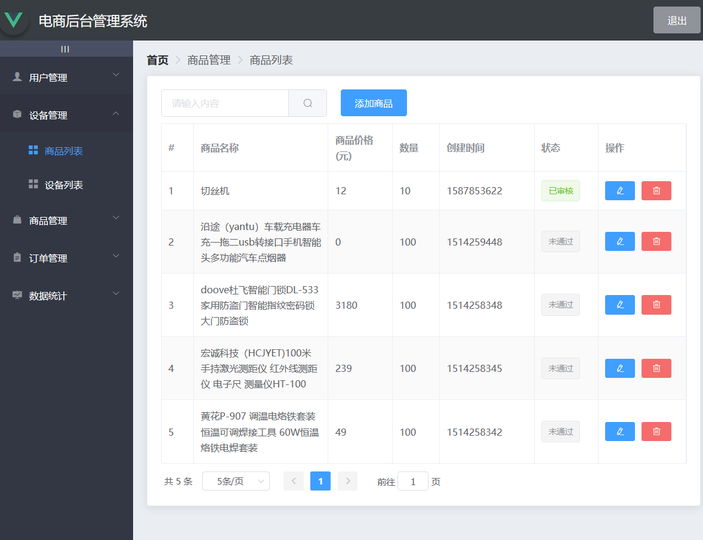
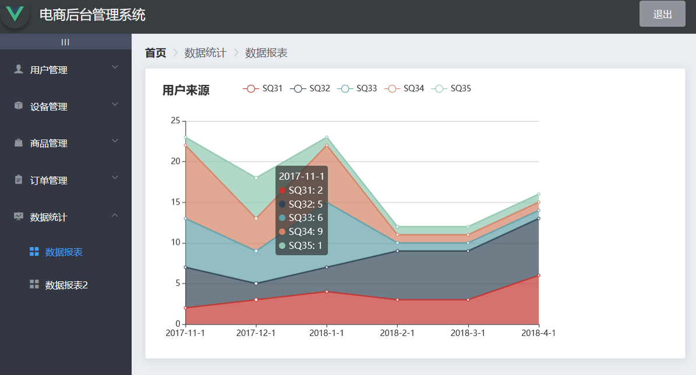

# vue_shop

## Project setup
```
yarn install
```

### Compiles and hot-reloads for development
```
yarn serve
```

### Compiles and minifies for production
```
yarn build
```

### Lints and fixes files
```
yarn lint
```

### Customize configuration
See [Configuration Reference](https://cli.vuejs.org/config/).

> [!NOTE]
> 原本用于展示后端服务停掉了，目前只能在本地运行。
> 需要注意的配置有数据库版本，以及一些依赖的兼容问题（npm update）

#### 页面预览：
|   |  |
|-------------------------|--------------------------|
| |  |


